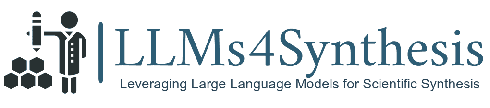

<div align="center">
 <h1>ORKG Synthesis Dataset</h1>
</div>

[//]: # (<h3>Science Synthesis</h3>)

<div align="center">
 
</div>

<div align="center">

[](https://opensource.org/licenses/MIT)
[](https://github.com/psf/black)
[](https://pycqa.github.io/isort/)
[](https://github.com/pre-commit/pre-commit)

</div>

<div style="color:red;">This work is accepted for publication at JCDL-2024 conference.</div>

### What is the ORKG Synthesis Dataset?

We develop a methodology to collect and process scientific papers into a format  ready for synthesis using the Open Research Knowledge Graph, a multidisciplinary platform that facilitates the comparison of scientific contributions. Where later, we introduce new synthesis types —-  paper-wise, methodological, and thematic —- that focus on different
aspects of the extracted insights. Utilizing Mistral-7B and GPT4 , we generate a large-scale dataset of these syntheses.  The established nine quality criteria for evaluating these syntheses, assessed by both an automated LLM evaluator (GPT-4) and a human-crowdsourced survey.


### LLMs4Synthesis
The **LLMs4Synthesis** framework on top of this datase is avaliable at  https://github.com/HamedBabaei/LLMs4Synthesis.


### Citation
Preprint:
```
@misc{giglou2024llms4synthesisleveraginglargelanguage,
      title={LLMs4Synthesis: Leveraging Large Language Models for Scientific Synthesis},
      author={Hamed Babaei Giglou and Jennifer D'Souza and Sören Auer},
      year={2024},
      eprint={2409.18812},
      archivePrefix={arXiv},
      primaryClass={cs.CL},
      url={https://arxiv.org/abs/2409.18812},
}
```
